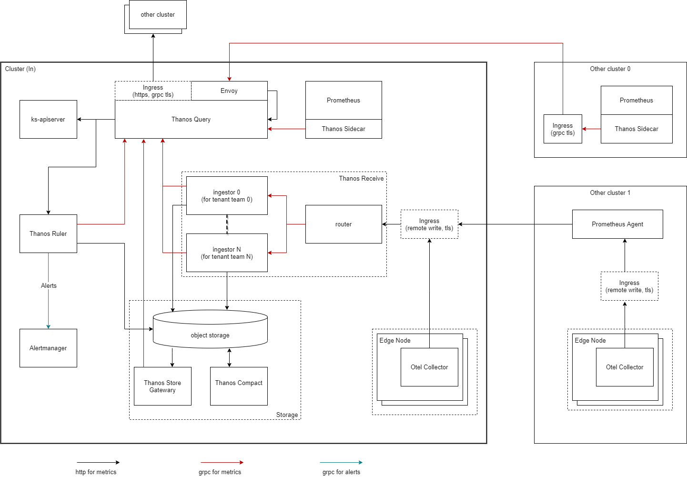

# PaodinMonitoring

PaodinMonitoring provides an optimized multi-cluster monitoring solution based on prometheus(server/agent) and thanos.

## Design



The architecture diagram above covers a variety of scenarios for which PaodinMonitoring applies.

## CRDs

PaodinMonitoring contains an operator that acts on the following CRDs to deploy some key components: 

- `Thanos`, which defines a desired thanos cluster contains multiple thanos components: 
    - `Query` for a Thanos Query instance, which can query from the Receive instances with ingestor mode and the Store Gateway instance in current thanos cluster, and other external thanos StoreAPI servers. It also will be with an envoy sidecar container to proxy query requests requiring auth to secure StoreAPI servers.  
    - `Receive` for multiple Thanos Receive instances which contains one receive router to receive external remote write requests, and multiple ingestors for different tenants to land data from the router.  
    - `StoreGateway` for a Thanos Store Gateway instance to provide query for metrics in a object storage as a StoreAPI server.
    - `Compact` for a Thanos Compact instance to compact metrics block and manage metrics lifecycle. 

To learn more about them have a look at the [api doc](docs/api.md).

## QuickStart

Install PaodinMonitoring:

```shell
kubectl apply -f https://raw.githubusercontent.com/kubesphere/paodin-monitoring/master/config/bundle.yaml
```

Create a Thanos cluster:

```shell
kubectl apply -f https://raw.githubusercontent.com/kubesphere/paodin-monitoring/master/config/samples/monitoring_v1alpha1_thanos.yaml
```

> See [here](./docs/usage.md) to learn more usages.

## Roadmap

- [x] Define CRDs to configure thanos components: query, receive, store gateway, compact.  
- [x] Implement proper deployment for upper components.   
- [x] Provide configuration for envoy sidecar which proxies query requests to the secure stores.
- [x] Ensure that the receive router routes received remote write requests to the receive ingestors.  
- [x] Ensure that the query component queries from the receive ingestors and the store gateway in its cluster.
- [ ] Add more configurable items to CRDs for configuring individual components flexibly.  
