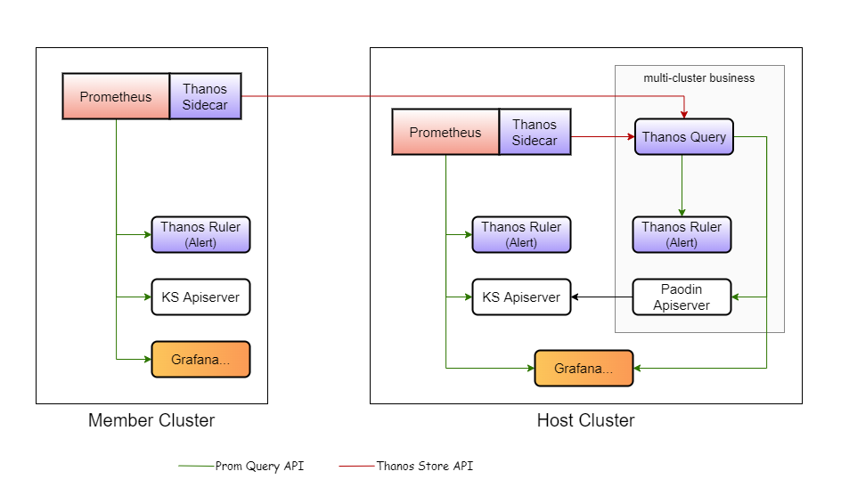
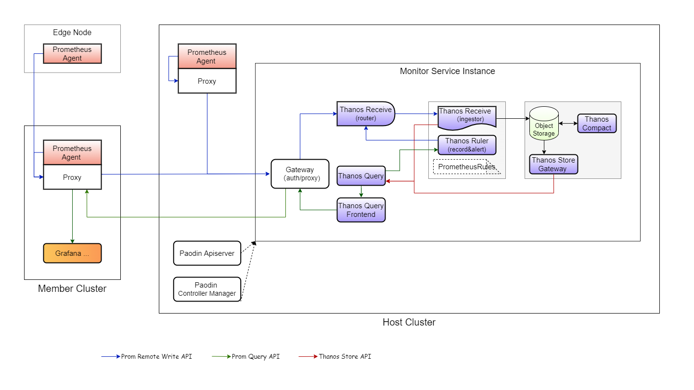

# Host/Members Mode

Refer to the following example for multi-cluster monitoring of KubeSphere platform.

> Please firstly refer to [here](../README.md#quickstart) to install paodin-controller-manager.

## Scattered

Each cluster stores its own metric data, and host cluster can query data from all clusters. The flow in this scenario is as follows: 

 

Follow the following steps to deploy components:   

1. On all clusters, configure Thanos Sidecar and external labels for Prometheus:

  ```shell
  kubectl -n kubesphere-monitoring-system patch prometheus k8s --patch='{"spec":{"externalLabels":{"cluster":"<cluster_name>"},"thanos":{}}}' --type=merge
  ```

2. On host cluster, deploy Query to proxy all Thanos Sidecar stores: 

  ```shell
  cat <<EOF | kubectl apply -f -
  apiVersion: monitoring.paodin.io/v1alpha1
  kind: Service
  metadata:
    name: scattered
    namespace: kubesphere-monitoring-system
  spec:
    query:
      replicaLabelNames:
      - prometheus_replica
      stores:
      - addresses: 
        - prometheus-operated:10901
        - <member-prometheus-svc>:10901
  EOF
  ```


## Central

Each cluster writes metric data to host cluster, and then queries data from host cluster. The flow in this scenario is as follows: 

 

> Use object storage for long term storage.

Follow the following steps to deploy components:   

1. On host cluster, create Storage for object storage config: 

  &#8195;&#8195;First, prepare the secret for the Storage.

  ```shell
  cat <<EOF | kubectl apply -f -
  apiVersion: v1
  kind: Secret
  metadata:
    name: storage-secret
    namespace: kubesphere-monitoring-system
  type: Opaque
  data:
    accessKey: <your-access-key>
    secretKey: <your-secret-key>
  EOF
  ```

  &#8195;&#8195;Then create Storage that references the secret.

  ```shell
  cat <<EOF | kubectl apply -f -
  apiVersion: monitoring.paodin.io/v1alpha1
  kind: Storage
  metadata:
    name: default
    namespace: kubesphere-monitoring-system
  spec:
    S3:
      bucket: "xxxxxxxxxx"
      endpoint: "s3.pek3b.qingstor.com:443"
      accessKeyRef: 
        name: storage-secret
        key: accessKey
      secretKeyRef: 
        name: storage-secret
        key: secretKey
    EOF
  ```

2. On host cluster, create a service instance: 

  ```shell
  cat <<EOF | kubectl apply -f -
  apiVersion: monitoring.paodin.io/v1alpha1
  kind: Service
  metadata:
    name: central
    namespace: kubesphere-monitoring-system
  spec:
    tenantHeader: cluster
    defaultTenantId: unknown
    tenantLabelName: cluster
    storage:
      name: default
      namespace: kubesphere-monitoring-system
    gateway: {}
    query:
      replicaLabelNames:
      - prometheus_replica
      - thanos_receive_replica
      - thanos_ruler_replica
    router:
      replicationFactor: 2
    queryFrontend:
      cacheConfig:
        type: IN-MEMORY
        inMemory:
          maxSize: 500M
          maxSizeItems: 0
          validity: 0
  EOF
  ```

3. Controller-manager enables the KubeSphere adapter feature (default true), which creates or deletes tenant CR according to the lifecycle of KubeSphere cluster, and then automatically extends Ingester, Ruler, Store, and Compactor based on the tenant.

  &#8195;&#8195;Automatically generated Tenant CR looks like this.

```yaml
apiVersion: monitoring.paodin.io/v1alpha1
kind: Tenant
metadata:
  labels:
    monitoring.paodin.io/service: kubesphere-monitoring-system.central
  name: host
spec:
  storage:
    name: central
    namespace: kubesphere-monitoring-system
  tenant: host
status:
  ingester:
    name: central-central-auto-0
    namespace: kubesphere-monitoring-system
  ruler:
    name: host
    namespace: kubesphere-monitoring-system
```

4. On all cluster, deploy agent-proxy
```shell
cat <<EOF | kubectl apply -f -
  apiVersion: apps/v1
  kind: Deployment
  metadata:
    labels:
      app.kubernetes.io/name: paodin-monitoring-agent-proxy
      component: paodin
    name: paodin-monitoring-agent-proxy
    namespace: kubesphere-monitoring-system
  spec:
    replicas: 1
    selector:
      matchLabels:
        app.kubernetes.io/name: paodin-monitoring-agent-proxy
        component: paodin
    template:
      metadata:
        labels:
          app.kubernetes.io/name: paodin-monitoring-agent-proxy
          component: paodin
      spec:
        containers:
        - image: kubesphere/paodin-monitoring-agent-proxy:latest
          args: 
            - --gateway.address="<gateway_address>"
            - --tenant="<cluster_name>"
          name: agent-proxy
          ports:
          - containerPort: 9090
            protocol: TCP
          resources:
            limits:
              cpu: 150m
              memory: 300Mi
            requests:
              cpu: 50m
              memory: 100Mi
  ---
  apiVersion: v1
  kind: Service
  metadata:
    labels:
      app.kubernetes.io/name: paodin-monitoring-agent-proxy
      component: paodin
    name: paodin-monitoring-agent-proxy
    namespace: kubesphere-monitoring-system
  spec:
    selector:
      app.kubernetes.io/name: paodin-monitoring-agent-proxy
      component: paodin
    ports:
    - port: 9090
      protocol: TCP
      targetPort: 9090
    type: ClusterIP
EOF
```

5. On all clusters, configure Prometheus to write to agent-proxy:  

  ```shell
  kubectl -n kubesphere-monitoring-system patch prometheus k8s --patch='{"spec":{"remoteWrite":[{"url":"http://paodin-monitoring-agent-proxy.kubesphere-monitoring-system.svc:9090/api/v1/receive"}]}}' --type=merge
  ```

6. On member clusters, configure ks-apiserver to read from agent-proxy:  

  update monitoring endpoint as follows by `kubectl -n kubesphere-system edit cm kubesphere-config`:   

  ```yaml
  ...
  data:
    kubesphere.yaml: |
      ...
      monitoring:
        endpoint: http://paodin-monitoring-agent-proxy.kubesphere-monitoring-system.svc:9090
        ...
      ...
  ...
  ```

7. On host cluster, configure ks-apiserver to read from paodin-apiserver

  todo;
