# autoscaling

## Motivation

To reduce the burden on Ingestor/Ruler, we plan to automatically scale Ingestor with 1:N. The ruler scales 1:1 automatically because we do not want data to mix

## Goals

* ThanosReceiveIngestor scales with Tenant 1:n automatically

* ThanosRuler scales with Tenant 1:1 automatically

## Proposal

### ThanosReceiveIngestor autoscaling

#### autoscaling

Add/Update Tenant Event

When a create event is received, Tenant Add [finalizers](https://kubernetes.io/docs/concepts/overview/working-with-objects/owners-dependents/#ownership-and-finalizers) field. Then according to tenant's Service and Storage, traverse ingestorMapping according to the index, if it is currently empty, create a new instance, otherwise check len(ingestorItem.Spec.Tenants) < t.DefaultTenantsPerIngestor，if so, select the instance.

When an update event is received, the tenant checks whether Service and Storage match. If they do not match, remove Tenant from ingestor and trigger the next update event.

* Delete Tenant Event

When a delete event is received, the tenant is removed from the Ingestor and the Tenant's [finalizers](https://kubernetes.io/docs/concepts/overview/working-with-objects/owners-dependents/#ownership-and-finalizers) field, When ingestor's Tennats are empty, it will be reclaimed.

#### recycle

When ingestor's Tennats are empty, it will be reclaimed:

* When the tenant is empty condition is triggered, the ingestor is not deleted immediately.
* First add two labels to ingestor, "monitoring.paodin.io/ingestor-state=deleting" and "monitoring.paodin.io/ingestor-deleting-time=`time.Now() + defaultIngestorRetentionPeriod`".
* If it is used by another tenant during the `defaultIngestorRetentionPeriod`, the label is updated.
* If tenant is not in use after `defaultIngestorRetentionPeriod`, delete it.
* `defaultIngestorRetentionPeriod` can be updated from the command line or configuration file, The default 3 h.

### ThanosRuler autoscaling

ThanosRuler can be autoscaled with tenant in a 1:1 ratio. It is implemented by [metadata.ownerReferences](https://kubernetes.io/docs/concepts/overview/working-with-objects/owners-dependents/#owner-references-in-object-specifications).

## Reference

[tenant](2022-07-tenant.md)